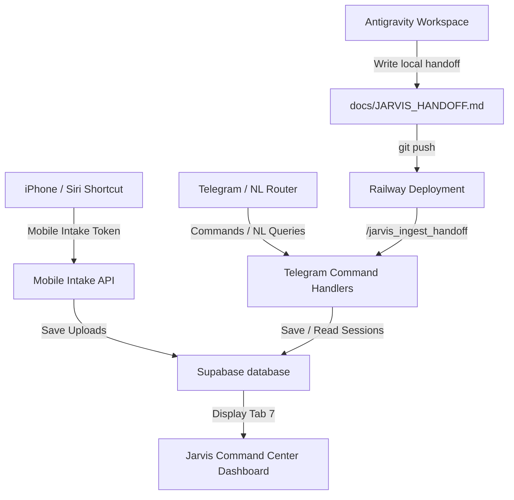

# Jarvis Phase 10: iPhone + Antigravity Context Sync

## Purpose
This document specifies Phase 10: iPhone + Antigravity Context Sync for Jarvis. It enables developers and iPhone shortcuts to synchronize structured updates, links, screenshots, and work sessions into Supabase, and displays the context in Telegram, the Morning Brief, and the admin dashboard, under strict safety limits.

## Architecture


## iPhone Shortcut Setup
All shortcuts use the **mobile intake token** (`Bearer <mobile_token>`) and are restricted to `/api/jarvis/mobile-intake` and `/api/jarvis/daily-brief`.
1. **Send Note to Jarvis**: Captures text note. Supported parameters: `intake_source = shortcut`, `task_type = text`, `project_slug`, `text_content`.
2. **Send Screenshot to Jarvis**: Uploads a screenshot safely and registers the HTTPS URL.
3. **Send Link to Jarvis**: Sends a URL and notes to keep as context.
4. **Send Project Update to Jarvis**: Stores a project update (`task_type = project_update`).
5. **Morning Brief from Jarvis**: Requests morning brief with `format=siri` or `format=json`.

## safe Antigravity Handoff Workflow
Ingestion of local developer work handoffs operates via:
1. Antigravity updates the template `docs/JARVIS_HANDOFF.md` locally.
2. Changes are committed and pushed to git.
3. The developer runs `/jarvis_ingest_handoff` from Telegram. Production Jarvis reads only the deployed `docs/JARVIS_HANDOFF.md` file, parses and sanitizes content, and stores it in the database.

## Telegram Commands
- `/jarvis_session_start <project_slug> <optional_description>`
- `/jarvis_session_update <project_slug> <summary>`
- `/jarvis_session_done <project_slug> <summary>`
- `/jarvis_session_status`
- `/jarvis_session_latest`
- `/jarvis_session_project <project_slug>`
- `/jarvis_ingest_handoff`

## Natural Language Examples
### English
- "start a work session for SeptiVolt" -> Gate to `/jarvis_session_start septivolt`
- "summarize my current work session" -> Execute `/jarvis_session_status`
- "finish this work session" -> Gate to `/jarvis_session_done`
- "what did Antigravity change today" -> Execute `/jarvis_session_latest`
- "show my phone captures" -> Execute `/jarvis_mobile_inbox`

### Spanish
- "empieza una sesión para SeptiVolt" -> Gate to `/jarvis_session_start septivolt`
- "resume mi sesión actual" -> Execute `/jarvis_session_status`
- "termina esta sesión" -> Gate to `/jarvis_session_done`
- "qué cambió en Antigravity hoy" -> Execute `/jarvis_session_latest`
- "muéstrame las capturas del teléfono" -> Execute `/jarvis_mobile_inbox`

### Spanglish
- "start sesión para Cresca" -> Gate to `/jarvis_session_start cresca`
- "save this update para SeptiVolt" -> Gate to `/jarvis_session_update septivolt`
- "qué changed today en Antigravity" -> Execute `/jarvis_session_latest`

## Dashboard Behavior
Tab 7 "Work Sessions" is added to the Jarvis Command Center:
- **Active Work Context**: Current project, summary, blockers, and next actions.
- **Consolidated View**: Blockers and actions from sessions and priorities.
- **Session History**: Historical list of sessions.
- In **Tab 5 (Mobile Inbox)**: Added columns to show `Caption` and `Language`.

## API Endpoints
All require `INTERNAL_ADMIN_TOKEN` headers (blocked for mobile tokens):
- `GET /api/jarvis/work-sessions`
- `GET /api/jarvis/work-sessions/latest`
- `GET /api/jarvis/work-sessions/project/:project_slug`
- `POST /api/jarvis/work-sessions/start`
- `POST /api/jarvis/work-sessions/update`
- `POST /api/jarvis/work-sessions/done`
- `POST /api/jarvis/handoff/ingest`

## Safety Boundaries
- **No arbitrary reads**: Handoff reads only `docs/JARVIS_HANDOFF.md`.
- **Token Security**: Shortcuts are forbidden from using admin secrets.
- **Audit Sanitization**: Ingested files and logs redacted for tokens, DB URLs, and secrets.
- **High-Risk commands**: Commands that write or mutate status require explicit slash execution.

## Rollback Plan
If validation fails, revert git commits on the master branch:
```bash
git revert <commit_hash>
git push origin master
```
This restores all files to pre-Phase 10 state.
