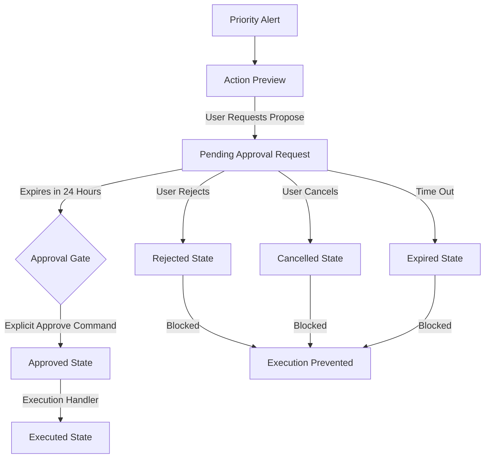

# Jarvis Phase 7: Approval-Gated Action Layer

This document outlines the architecture, risk classification, approval flow rules, and safety boundaries for the Jarvis Approval-Gated Action Layer (Phase 7).

---

## 🛡️ Core Security Rule: Phase 7A Read-Only Safety Boundary

> [!IMPORTANT]
> **No Live External Mutations**
> Under Phase 7A, Jarvis is strictly forbidden from executing any external write or destructive action on third-party APIs (Gmail, Google Drive, or live deployment services). Action execution must remain strictly internal to Jarvis' database or dry-run queues.

---

## 📊 Action Risk Levels

Jarvis classifies recommended actions into four distinct risk tiers to ensure appropriate operational governance:

| Risk Level | Description | Action Examples |
| :--- | :--- | :--- |
| **Low** | Internal note/task modifications that do not affect other pipelines. | Create internal Jarvis task/note, resolve a database blocker. |
| **Medium** | State updates to local triage registers or dry-run execution queues. | Mark mobile intake processed, archive processed items, queue a Hermes dry-run job. |
| **High** | Actions preparing external-facing content or requesting asset references. | Generate email reply text proposal (printed to Telegram only), reference a Google Drive file link locally. |
| **Critical** | Live mutations, API writes, and destructive deletions. | Gmail send/draft-create, Google Drive file edits/moves, publishing live code. *(Strictly disabled under Phase 7A)* |

---

## 🔄 Approval Lifecycle & Gating Logic

The approval flow implements a strict "fail-closed" mechanism:

1. **Explicit Consent Required**: The default status of any proposal is `pending`. No action can execute without moving to the `approved` status.
2. **Locking & Double Execution Guard**: The approval status must be updated to `approved` first in a single transaction/statement, checking that it was previously `pending` to avoid double execution. Once status becomes `executed`, the action cannot be rerun.
3. **24-Hour Expiration**: Pending approvals are stamped with an `expires_at` timestamp set exactly 24 hours from creation. Any attempt to execute an expired request will transition its status to `expired` and reject execution.
4. **Secret Leaks Prevention**: The Telegram handler for `/jarvis_approval <approval_id>` truncates and sanitizes the proposed payload string if it exceeds 500 characters to prevent exposing secrets, API tokens, or oversized outputs.

---

## 🛠️ Live Telegram Commands Reference

Operators can manage the action approval queue directly from Telegram using these commands:

*   `/jarvis_action_preview <priority_id>`
    *   **Tier**: `read_only`
    *   **Description**: Previews the recommended action, risk level, explanation of what will happen, and what will *not* happen.
*   `/jarvis_propose_action <priority_id>`
    *   **Tier**: `read_only`
    *   **Description**: Creates a new pending approval request in `jarvis_approval_requests` with a 24-hour expiration.
*   `/jarvis_approvals`
    *   **Tier**: `read_only`
    *   **Description**: Lists all currently pending action approvals.
*   `/jarvis_approval <approval_id>`
    *   **Tier**: `read_only`
    *   **Description**: Shows detailed specifications and the sanitized payload for a specific approval ID.
*   `/jarvis_approve <approval_id>`
    *   **Tier**: `operator`
    *   **Description**: Approves and immediately triggers the execution of the action.
*   `/jarvis_reject <approval_id>`
    *   **Tier**: `operator`
    *   **Description**: Rejects the request, moving status to `rejected`.
*   `/jarvis_cancel_approval <approval_id>`
    *   **Tier**: `operator`
    *   **Description**: Cancels the pending request, moving status to `cancelled`.

---

## 📋 Live Telegram Validation Checklist

Before marking Phase 7 fully validated, operator must verify the following scenarios in Telegram:

- [ ] Run `/jarvis_action_preview <id>` for an email priority. Verify it shows **HIGH** risk level and states that no actual email will be sent.
- [ ] Run `/jarvis_propose_action <id>`. Verify it successfully saves to the database and returns a proposal ID.
- [ ] Run `/jarvis_approvals`. Confirm the new proposal is listed in the pending approvals output.
- [ ] Run `/jarvis_approval <approval_id>`. Verify that the payload is formatted cleanly and no secret values are leaked in the output.
- [ ] Run `/jarvis_reject <approval_id>`. Confirm that it transitions to `rejected`.
- [ ] Attempt `/jarvis_approve <approval_id>` on the rejected ID. Verify it returns a rejection message and does not execute.
- [ ] Propose another action, run `/jarvis_approve <approval_id>`. Verify the action successfully executes, performs only the internal DB/queue update, and outputs the result in Telegram.
- [ ] Attempt `/jarvis_approve <approval_id>` again on the executed ID. Verify it fails with a double-execution warning.
