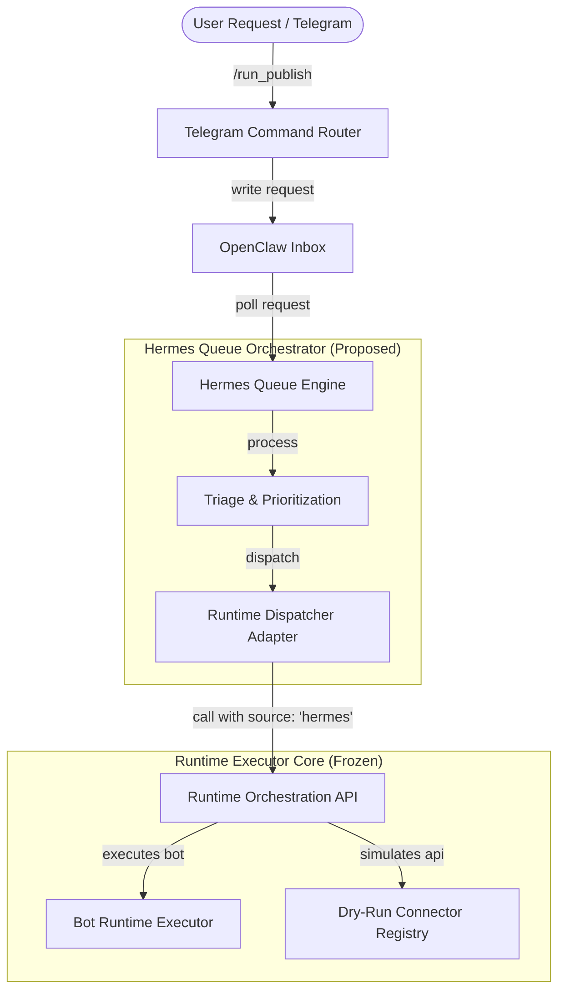
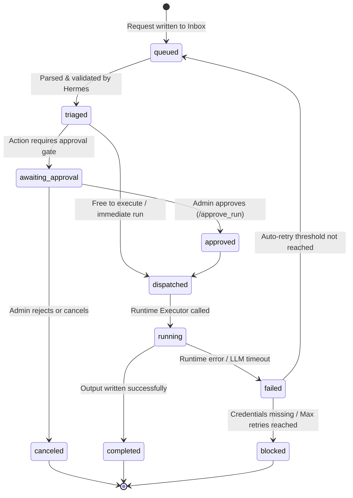

# Hermes Core Design Specification (H0/H1)

This document details the **Hermes Readiness Audit (H0)** and the **Hermes Core Design Specification (H1)**. Hermes acts as the queue orchestration and task triage layer of OpenClaw, operating directly above the deterministic bot execution foundation.

---

## 🔍 H0 — Hermes Readiness Audit Summary

A baseline audit of the `openclaw` repository has been conducted to verify integration boundaries:

1.  **Repository Structures**:
    *   `openclaw/runtime/`: Holds the frozen bot executor, permissions tier check, approvals engine, telemetry logger, and dry-run action engine.
    *   `openclaw/bots/`: House the instructions and workflows for `content-forge`, `lead-acquisition-engine`, and `revenue-master-orchestrator`.
    *   `openclaw/inbox/`: Collects incoming raw `.json` request payloads from Telegram interfaces.
    *   `openclaw/outbox/`: Stores generated markdown result files and local Drive publishing manifests.
    *   `openclaw/hermes/` [NEW]: This designated folder will host the Hermes queue orchestration modules, adapters, status checkers, and data files.

2.  **Runtime Orchestration API Boundary**:
    *   Located at [runtime-orchestration-api.js](file:///c:/Users/12132/.gemini/antigravity/playground/primal-astro/openclaw/runtime/runtime-orchestration-api.js).
    *   Successfully verifies 10 interface methods accepting unified parameters (`actor`, `source`, `metadata`) and returning a structured JSON response contract.
    *   Allows immediate executions (`createRuntimeBotRun`, `createRuntimePresetRun`, `createDryRun`) and gated approval requests (`createPublishApproval`, `createPresetPublishApproval`, `createDryRunPublishApproval`).

3.  **Safety & Frozen State Verification**:
    *   **Registry Boundary**: Verified that the Connector Registry (`connector-registry.js`, `connector-schemas.json`) is strictly `dry_run_only` with `realExecutionEnabled: false`. No live external writes (GHL, Airtable, Webhooks, SMS, Email, Google Places) are functional.
    *   **Frozen Core**: All execution logic, role mappings, and approval gates inside the `openclaw/runtime/` module are verified as frozen.
    *   **Passing Tests**: Checked all 272 runtime executor unit tests, bot routing verification, and Drive sync tests. All are 100% green.

---

## 🏛️ 1. Purpose & Core Principles

Hermes serves as the **asynchronous queue scheduler and triaging brain** of OpenClaw. It does not replace the executor core, but sits on top of it to manage workflow scheduling and task distribution.



### Core Architecture Responsibilities

*   **Runtime Executor (Deterministic Core)**: Remains the isolated, synchronous task executor. It loads bot instructions, parses prompts, calls mock LLM adapters, handles Drive file transfers, and writes files to the outbox. It is **unaware** of queue scheduling, job ordering, or prioritization.
*   **Hermes (Queue Brain)**: Owns job queuing, scheduling, priority rules, failure retry counts, workflow selection logic, and cross-job tracking.
*   **Telegram Handler (Operator Interface)**: Serves as the interactive control surface for administrators to inspect queue sizes, approve items, cancel jobs, or check systems.
*   **Approval Gates**: Sensitive actions (specifically Drive publishing or dry-run publishes) must generate pending approval records (`ap_...`) requiring manual verification.
*   **Safety Isolation**: External integrations remain simulated locally (dry-run-only) inside the registry.

---

## 🔄 2. Source Contract

To trace job origins through audit logs, all interactions from Hermes must declare the source type:

*   **`source: "hermes"`**: Must be used for all operations triggered by the Hermes scheduler.
*   **Supported Source Array**: The Runtime API preserves logs for sources: `telegram`, `hermes`, `test`, `system`.

---

## 🛡️ 3. Rules of Responsibility

### Allowed Hermes Operations
*   Accepting incoming task payloads written to `openclaw/inbox/`.
*   Prioritizing pending items based on user authority and workflow context.
*   Tracking job execution states (triaged, queued, running, completed).
*   Triaging work requests to select appropriate bot slugs (e.g., routing solar templates to `lead-acquisition-engine`).
*   Requesting approval IDs from Runtime for gated workflows.
*   Dispatching ready, authorized jobs to the Runtime Orchestration API.
*   Maintaining separate persistence files for queue indices.

### Strictly Forbidden Operations
*   **Bypassing the Runtime API**: Hermes must never directly require or invoke modules inside `openclaw/runtime/` other than the public methods exposed in `runtime-orchestration-api.js`.
*   **Bypassing Approval Gates**: Gated commands must request approval tokens. Hermes cannot force execution of a gated Tier 4 action without a prior valid admin signature.
*   **Enabling Real External Connector Execution**: Real network API clients (Airtable, Twilio, GHL CRM, scrapers) must not be instantiated.
*   **Modifying Runtime Internals**: No internal files inside `openclaw/runtime/` may be edited, maintaining code freeze isolation.

---

## 📊 4. Queue Lifecycle

Hermes job states are tracked through a defined lifecycle state machine:



### State Definition Table

| Status | Description |
| :--- | :--- |
| `queued` | The raw task request has been written to the incoming inbox. |
| `triaged` | Hermes has validated parameters, checked bot slugs, and resolved capability requirements. |
| `awaiting_approval` | Gated command (e.g., publish request) is held, waiting for manual admin approval. |
| `approved` | The required approval signature was successfully granted by a verified administrator. |
| `dispatched` | The task has been sent to the Runtime Orchestration API. |
| `running` | The Runtime Executor is currently generating content or writing outputs. |
| `completed` | Bot execution succeeded, and markdown results are saved in the outbox. |
| `failed` | The executor encountered a timeout, model error, or configuration failure. |
| `canceled` | The job was rejected by an administrator or explicitly canceled. |
| `blocked` | Execution cannot proceed due to missing credentials, validation blocks, or max retries. |

---

## 💾 5. Data Model Proposal

Hermes queue logs will be stored in a dedicated local file `openclaw/hermes/hermes-queue.json`.

### Queue Schema Definition
```typescript
interface HermesQueueJob {
  hermesJobId: string;        // Prefix: 'hm_YYYYMMDD_HHMMSS_<rand>'
  runtimeJobId: string | null;// Resolved rt_... ID from Runtime once dispatched
  source: "hermes";           // Source tracking label
  requestedBy: string;        // Telegram Chat ID of requesting actor
  botId: string;              // Target bot slug (e.g., 'content-forge')
  priority: "high" | "normal" | "low";
  status: "queued" | "triaged" | "awaiting_approval" | "approved" | "dispatched" | "running" | "completed" | "failed" | "canceled" | "blocked";
  approvalId: string | null;  // Gated approval token (ap_...) if applicable
  inputSummary: string;       // Capped request context string
  outputPath: string | null;  // Path of the outbox result markdown file
  driveLink: string | null;   // Drive web url if published
  errorCategory: string | null;// Standardized error categories passed from API
  safeMessage: string | null;  // Clean error description text
  createdAt: string;          // ISO 8601 creation timestamp
  updatedAt: string;          // ISO 8601 modification timestamp
  metadata: Record<string, any>;// Extensible metadata bag (e.g. { hermesJobId })
}
```

---

## 🔌 6. Runtime Adapter Boundary

All task dispatch calls from Hermes to the Runtime API must go through a single adapter module. This guarantees that if Runtime endpoints change, only the adapter needs adjustment.

### Proposed File
[runtime-dispatcher-adapter.js](file:///c:/Users/12132/.gemini/antigravity/playground/primal-astro/openclaw/hermes/runtime-dispatcher-adapter.js)

### Interface Spec Example
```javascript
/**
 * openclaw/hermes/runtime-dispatcher-adapter.js
 */
const api = require('../runtime/runtime-orchestration-api');

async function dispatchJobToRuntime(hermesJob) {
  const payload = {
    botSlug: hermesJob.botId,
    request: hermesJob.inputSummary,
    actor: hermesJob.requestedBy,
    source: 'hermes',
    metadata: {
      hermesJobId: hermesJob.hermesJobId
    }
  };
  
  if (hermesJob.requiresPublish) {
    return await api.createPublishApproval(payload);
  }
  
  return await api.createRuntimeBotRun(payload);
}
```

---

## 🛠️ 7. Telegram Control Plan

The following Telegram commands will serve as the administrative control surface for queue management:

*   `/hermes_status` — Displays active Hermes engine health, queue counts, and state machine stats.
*   `/hermes_queue` — Lists the current pending queue (sorted by priority and age).
*   `/hermes_latest` — Displays the details and trace logs of the latest processed job.
*   `/hermes_read <hermes_id>` — Reads the trace payload, inputs, outputs, and statuses of a specific job.
*   `/hermes_approve <approval_id>` — Shortcut to approve a gated queue task.
*   `/hermes_cancel <hermes_id>` — Cancels a pending or queued task.
*   `/hermes_retry <hermes_id>` — Manual retry trigger for a failed or blocked task.

---

## 🔒 8. Approval Integration Plan

Rather than creating a separate approval system, **Hermes must map directly to the existing Runtime approval system**:
1.  When Hermes triages a task requiring Tier 4 capabilities, it invokes `api.createPublishApproval` or `api.createDryRunPublishApproval`.
2.  The Runtime API returns an approval ID (`ap_...`).
3.  Hermes transitions the queue item status to `awaiting_approval` and stores the `approvalId` key.
4.  Admin executes `/approve_run <approval_id>` or `/reject_run <approval_id>`.
5.  Upon successful approval, Runtime triggers bot execution.
6.  Hermes detects completion through event log monitors, matches `approvalId`, and marks the queue item status as `completed`.

---

## 👁️ 9. Observability Plan

To ensure developer-friendly debugging, Hermes will support end-to-end trace maps linking:
1.  **Incoming Trigger**: Raw payload inside `openclaw/inbox/` matching `/run_publish`.
2.  **Hermes Registry**: Queue index entry with `hermesJobId: "hm_123"`.
3.  **Approval Gate**: Gated ID `ap_456` signed by admin.
4.  **Runtime Telemetry**: Runtime job trace `rt_789` with mock completion stats.
5.  **Output Asset**: Created outbox file `2026-06-05_00-00-00_content-forge_runtime_result.md`.
6.  **Drive Manifest**: Google Drive publishing manifest linking the final asset.

---

## 🚀 Implementation Roadmap Status

### [x] H2 — Hermes Queue Engine Foundation (Completed)
*   **Summary**: Built the core persistence schema and validation models. Implemented file-store loading, atomic JSON writing with temporary locking, deterministic hashing for duplicate active checks, and lifecycle transition functions. Verified the foundation using 16 comprehensive sandbox assertions.
*   **Files Created**: `hermes-job-schema.js`, `hermes-queue-store.js`, `hermes-dedupe.js`, `hermes-queue-engine.js`, `scratch/test-hermes-queue-engine.js`.

### [x] H3 — Runtime Dispatcher Adapter (Completed)
*   **Summary**: Implemented `runtime-dispatcher-adapter.js` providing payload transformation, endpoint selection, and synchronous status transitions. Connects Hermes queue states with the frozen Runtime Orchestration API under the unified `source: "hermes"` contract. Automatically maps gated approvals (`awaiting_approval`) and captures error categories/safe messages on rejections. Verified with 7 sandbox tests.
*   **Files Created**: `runtime-dispatcher-adapter.js`, `scratch/test-hermes-runtime-dispatcher-adapter.js`.

### [x] H4 — Telegram Queue Control Plane (Completed)
*   **Summary**: Implemented the Telegram administrative controls interface for Hermes queue visibility and management. Added handlers for `/hermes_status`, `/hermes_queue`, `/hermes_latest`, `/hermes_read`, `/hermes_cancel`, `/hermes_retry`, `/hermes_dispatch`, `/hermes_approval`, and `/hermes_approve` inside the main command router. Evaluated all operations against the central capability-based roles system. Verified with 10 sandbox tests.
*   **Commands Implemented**:
    *   `/hermes_status` (Read Only) — Displays total/active/completed/failed queue stats, latest Job ID, and execution configuration.
    *   `/hermes_queue [filter]` (Read Only) — Lists recent queue jobs, accepting optional status filters (`active`, `failed`, `approval`, `completed`).
    *   `/hermes_latest` (Read Only) — Displays detailed status and latest lifecycle trace event for the most recent job.
    *   `/hermes_read <job_id>` (Read Only) — Displays comprehensive details and the last 5 trace events of a specific Hermes job.
    *   `/hermes_approval` (Read Only) — Lists all Hermes jobs currently in `awaiting_approval` status.
    *   `/hermes_cancel <job_id> [reason]` (Gated Operator) — Safely cancels active jobs and appends a lifecycle record. Rejects completed/failed runs.
    *   `/hermes_retry <job_id>` (Gated Operator) — Clones failed/blocked jobs and re-runs them via the Hermes dispatcher. Blocks duplicate active jobs.
    *   `/hermes_dispatch <job_id>` (Gated Operator) — Triggers manual dispatch of a queued or approved job to the Bot Runtime using the dispatcher adapter.
    *   `/hermes_approve <approval_id>` (Gated Approver) — Approves a gated publisher command using the existing approvals engine and updates the linked Hermes job status.
*   **Role Gates**: Read commands require a role mapping with `read_runtime` capability. Cancel, retry, and dispatch require `operator`, `publisher`, `approver`, or `super_admin`. Approvals require `approver` or `super_admin`.

### [ ] H5 — Queue Daemon Inbox Poller (Future Phase)
*   Implement a background folder watcher on `openclaw/inbox/` to dynamically ingest queued Telegram command files and auto-trigger triaging.

### [ ] H6 — Triage Matching Automation (Future Phase)
*   Establish pattern-matching logic to map queue inputs dynamically to approved bot slugs.

### [ ] H7 — Live Integration Gates (Future Phase)
*   Allow enabling real GHL CRM, Airtable, Twilio SMS/Email, or Webhook execution inside the Connector Registry under strict operator configuration switches.
