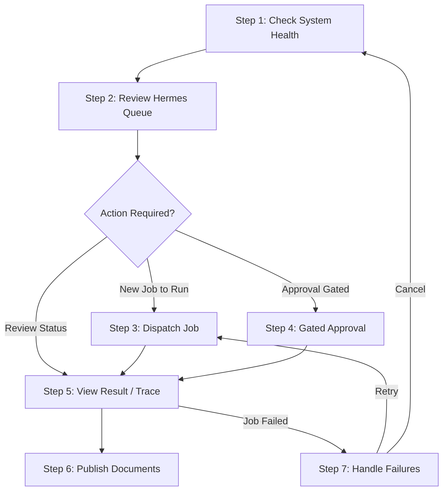

# 📖 Hermes Operator Runbook — Dry-Run Production Pilot

This runbook defines the daily operational procedures for Hermes Operators to monitor, run, dispatch, approve, and diagnose dry-run execution pipelines on the live Railway/Telegram system.

---

## 🔒 Operational Safeguards
1. **No Live Writes:** Every connector remains locked in `dry-run` simulation mode. All modifications are mock-only. No email, SMS, or CRM database changes are executed externally.
2. **Role Boundaries:** Command execution is strictly role-gated based on the Telegram Operator's user ID.
3. **No Code Mutations:** Do not modify codebase scripts directly. All job configurations must proceed via inbox ingestion or approved environment variables.

---

## 🛠 Daily Operator Workflow Sequence

### 🛰 Step 1 — Check System Health
Validate that the bot application and underlying runtime orchestrator are operating correctly before conducting operational steps.

- **`/status`**: Checks the general Telegram bot connection and overall environment mode status.
- **`/run_status`**: Queries the frozen Runtime Executor status. Check that `External Actions: no` and `Access Model: roles` are correctly reported.
- **`/hermes_health`**: Inspects Hermes queue and polling status. Validates queue file access, inbox poller checks, and reports the number of pending/processing/completed/failed jobs.
- **`/hermes_status`**: Provides a high-level summary of the active Hermes queue, the last ingested request, and system diagnostic info.

---

### 📥 Step 2 — Review Queue
Monitor pending requests ingested from the email/text inbox poller daemon.

- **`/hermes_queue`**: Lists the current queue state showing jobs in chronological order. Check for jobs marked `pending`, `held_for_approval`, or `processing`.
- **`/hermes_latest`**: Shows a summary of the single most recently ingested queue job.
- **`/hermes_read <job_id>`**: Outputs the details of a specific job, including its name, target bot, status, input summary, and timestamps.
- **`/hermes_trace <job_id>`**: Generates a detailed trace logs flow. Useful for understanding input payload variables, environment configurations, and target connector actions.

---

### 🚀 Step 3 — Dispatch Safely
Initiate execution of a pending job.

- **`/hermes_dispatch <job_id>`**: Sends the job payload to the Runtime Dispatcher Adapter.
  - *Dry-Run Safe Behavior:* The job executes under the `hermes` source. If approval is required by the target bot's policy, it automatically halts and transitions to `held_for_approval`. If no approval is required, it executes in dry-run mode and updates its status to `completed` or `failed`.

---

### 🔑 Step 4 — Gated Approval
Approve or reject jobs held under security gates.

- **`/hermes_approval`**: Lists all active approval gates pending human confirmation. Displays the `approval_id`, related `job_id`, requested bot action, and status.
- **`/hermes_approve <approval_id>`**: Approves the specified gate.
  - *Security Enforcement:* Only users with the `APPROVER` or `SUPER_ADMIN` role Chat ID can execute this command. Once approved, the job resumes execution automatically and updates its trace log.
  - *Rejection / Disapproval:* If a job is rejected, use `/hermes_cancel` to remove it from the queue safely.

---

### 📊 Step 5 — Review Result
Track output and verify that execution followed sanitization rules.

- **`/hermes_trace <job_id>`**: Confirm the execution steps, verifying that no live external writes occurred. Look for logs confirming simulated/dry-run outputs.
- **`/hermes_search <query>`**: Searches the Hermes job database for matching strings (e.g. searching by bot name, job ID, or customer identifier).
  - *Privacy Protection:* Output remains redacted of system paths, secrets, or credential structures.
- **`/hermes_failures`**: Fast-query command displaying the latest failed jobs to pinpoint runtime errors.

---

### 📂 Step 6 — Publish if Applicable
Compile and sync pilot deliverables to Google Drive directories (using simulated/local-root folders).

- **`/drive_publish_pending`**: Lists all generated documents awaiting publishing.
- **`/drive_publish_latest`**: Syncs the latest completed job documents to Google Drive.
  - *Duplicate Protection:* Safe to run multiple times. If already published, it returns the existing drive link instead of re-uploading.
- **`/drive_republish_latest`**: Forces a fresh upload and overwrites existing links. *Use only when explicit correction is required.*

---

### ⚠️ Step 7 — Failure Handling
Remediate failed jobs or remove invalid requests.

- **`/hermes_failures`**: Identifies which jobs are stuck in a `failed` state.
- **`/hermes_retry <job_id>`**: Re-queues a failed job as `pending`, resetting its failure count and allowing operators to dispatch it again.
- **`/hermes_cancel <job_id> <reason>`**: Aborts execution of a job permanently. Moves the job state to `cancelled` and appends the provided operator reason to its trace log.

---

## 🚨 Emergency Contacts & Escalation
If any unexpected live API calls or write actions are detected, proceed immediately to the **Emergency Stop Instructions** in [hermes-dry-run-pilot-checklist.md](file:///c:/Users/12132/.gemini/antigravity/playground/primal-astro/openclaw/hermes/hermes-dry-run-pilot-checklist.md) and alert the system administrators.
