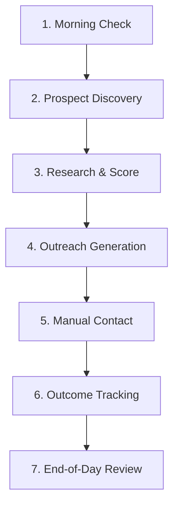

# OPS1 — Daily Operator Playbook: Hermes Manual Outreach

Welcome to the **Cresca OS / Hermes Daily Operator Playbook**. This playbook defines the step-by-step repeatable workflow for finding prospects, enriching them, evaluating B2B fit, generating copy, and manually executing outreach campaigns.

> [!WARNING]
> **SAFETY GATE IS ENFORCED (DRY-RUN ONLY)**
> * `realExecutionEnabled` is set to `false`.
> * Hermes **will not** send automated SMS, emails, or DMs.
> * Hermes **will not** write directly to GoHighLevel (GHL), CRM pipelines, webhooks, Meta, or Airtable.
> * All outreach copy must be copied manually from the Web Dashboard and sent via external communication channels (e.g., your own email client, SMS phone, or social profiles).

---

## 📅 The Daily 7-Step Workflow

### 1. Morning Cockpit Check
Start your day by reviewing outstanding follow-ups, pending jobs, and the active pipeline status.
* **Telegram commands to run:**
  * `/menu` - Retrieve the main operator keyboard.
  * `/cockpit_today` - View high priority prospects and follow-ups due today.
  * `/cockpit_next` - Preview scheduled follow-ups and pipeline distribution for the coming days.
* **Dashboard check:**
  * Open `/dashboard/cockpit` and filter by **Follow-up Due**. Address overdue prospects first.

### 2. Prospect Discovery
Find new local businesses in target niches and territories.
* **Method A: Web Dashboard**
  * Navigate to `/dashboard/prospects`.
  * Under **Discovery Search**, enter your search criteria:
    * **Query:** e.g., `roofing contractors` or `plumbing services`
    * **Region:** e.g., `Melville, NY` or `Suffolk County, NY`
    * **Field Profile:** `BASIC_DISCOVERY` or `ENRICHED_DISCOVERY` (Enriched pulls more metadata upfront).
  * Click **Run Discovery**.
* **Method B: Telegram**
  * Use the **Find Prospects** button or run `/discover_prospects <query> <region>`.

### 3. Research and Fit Scoring
Enrich discovered prospects with web-scraped data to analyze marketing and technical gaps.
* **Action:**
  * In the Prospects table, locate unscored leads.
  * Click **Outreach Handoff** or run `/research_prospect <prospectId>` and `/score_prospect <prospectId>` in Telegram.
  * This scrapes public sources and computes fit/urgency indexes.
* **Evaluation Criteria:**
  * View detailed findings at `/dashboard/research/view?researchId=<id>`.
  * Look for critical conversion gaps under **Lead Capture Gaps & Issues** (e.g., *No SMS widget*, *No web form*, *Poor mobile speed*, *Slow page load*).
  * Check **Scores Leaderboard** (`/dashboard/scores`). Focus your manual efforts on **HIGH Priority** fit scores (>80).

### 4. Outreach Generation
Let Hermes generate hyper-personalized copy angles based on the scraped gaps.
* **Action:**
  * Dispatch an outreach generation task for your target prospect.
  * Wait for the status in `/dashboard/queue` or `/dashboard/trace` to turn to `completed`.
  * Open `/dashboard/outreach/view?reviewId=<id>` to view the generated drafts.

### 5. Manual Contact
Review the custom copy drafts and dispatch outreach.
* **Action:**
  * On the outreach details page, inspect the drafts:
    * **SMS Outreach Draft:** Tailored hook mentioning a specific site gap.
    * **Email Outreach Draft:** Formal business introduction highlighting high-urgency fixes.
    * **Social DM Opener:** Short, high-CTR conversational hook.
    * **Discovery Call Script:** Interactive prompts for phone outreach.
  * Click the **Copy** button next to your chosen channel.
  * **Execute Outreach manually outside of Hermes:**
    * Paste and send SMS via your business phone.
    * Paste and send Email via your Outlook/Gmail client.
    * Send DMs via Facebook Messenger, Instagram, or LinkedIn.
  * *Tip:* Always review the copy briefly and personalize it further if necessary.

### 6. Outcome Tracking
Keep the pipeline state clean so follow-up steps align properly.
* **Action:**
  * Immediately after contacting, scroll to **Pipeline Actions** on the outreach page.
  * Update the fields:
    * **Pipeline Status:** Set to `contacted`.
    * **Last Contact Channel:** e.g., `sms`, `email`, or `dm`.
    * **Manual Contact Count:** Increment by 1.
    * **Next Follow-up Date:** Schedule the follow-up 2-3 days out if no reply is received.
    * **Operator Notes:** Add context (e.g., *"Sent FB message to owner John"*).
  * Click **Save Pipeline Changes**.

### 7. End-of-Day Review
Close out the day by logging metrics and ensuring no tasks are stuck.
* **Action:**
  * Run `/daily-brief` or view `/dashboard/brief` to verify that all dispatched queue jobs completed successfully.
  * Count your manual outreach volumes and pipeline shifts.
  * Update your copy of `openclaw/ops/OPS1_LIVE_USAGE_METRICS_TEMPLATE.md` with the day's stats.
