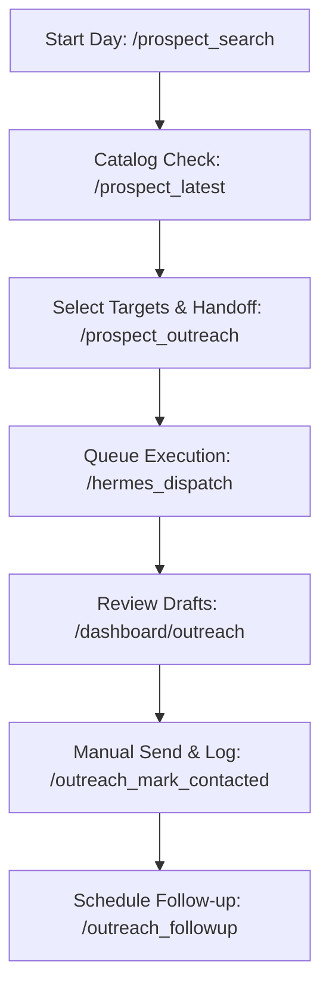

# Cresca OS Prospecting Playbook (Phase P6)

This playbook establishes a repeatable, high-efficiency solo-operator prospecting process using the manual pipeline features of OpenClaw and Hermes. It details workflows, commands, best practices, and guidelines for daily outbound operations.

---

## 1. Daily Prospecting Workflow

Follow this sequence daily to maintain a consistent flow of leads:

1. **Intake (08:30 - 09:00)**: Discover 10–25 new prospects in your target niche.
2. **Review & Batch (09:00 - 09:30)**: Select 3–5 high-intent prospects and hand them off to the outreach generation queue.
3. **Dispatch & Generation (09:30 - 09:45)**: Dispatch jobs via Hermes to generate personalized SMS, email, and DM scripts.
4. **Draft Polish & Manual Send (09:45 - 11:30)**: Access the dashboard workspace, customize scripts, manually send messages, and log contact status.
5. **Follow-ups & Logging (11:30 - 12:00)**: Check due-today follow-ups and schedule future follow-up dates.

---

## 2. Best Telegram Commands

Keep this quick reference handy for Telegram control:

| Command | Syntax | Purpose |
|---|---|---|
| `/prospect_search` | `/prospect_search <niche>` | Discovers and catalogs local prospects (Mock or Google Places). |
| `/prospect_latest` | `/prospect_latest` | Displays the 5 most recently discovered prospects. |
| `/prospect_outreach` | `/prospect_outreach <prospectId>` | Hands off a single prospect to the Hermes queue. |
| `/outreach_pipeline` | `/outreach_pipeline` | Shows counts of reviews across all status buckets. |
| `/outreach_today` | `/outreach_today` | Lists reviews due for manual follow-up today or overdue. |
| `/outreach_mark_contacted` | `/outreach_mark_contacted <reviewId> <channel>` | Logs a manual message sent (e.g. `sms`, `email`, `dm`). |
| `/outreach_followup` | `/outreach_followup <reviewId> <YYYY-MM-DD>` | Schedules next manual follow-up date. |

---

## 3. Best Dashboard Pages

* **Prospects Dashboard (`/dashboard/prospects`)**: 
  Used for searching, cataloging, and quick-dispatching prospects into outreach jobs. Use filters to sort by category or town.
* **Outreach Reviews Workspace (`/dashboard/outreach`)**: 
  The primary console for copying generated drafts, taking notes, updating contact statuses, scheduling follow-ups, and viewing pipeline counters.
* **Usage & Cost Ledger (`/dashboard/usage`)**:
  Used to monitor API keys query limits, monthly costs, and LLM token usage to ensure operations remain within safe bounds.

---

## 4. Target Niches

Primary high-converting niches for Cresca OS:
1. **Roofing Contractors**: High ticket sizes, high need for automated lead capture and SEO/AEO optimizations.
2. **HVAC & Plumbers**: Emergency-driven leads; benefit significantly from instant SMS responses.
3. **Solar Installation Providers**: High competitive density; requires structured lead qualification funnels.

---

## 5. Query Templates

Use these exact queries to feed into `/prospect_search`:
* `roofing contractors in Suffolk County NY`
* `hvac repair in Suffolk County NY`
* `plumbing services in Nassau County NY`
* `solar installers in Suffolk County NY`

*Note: Make sure to target specific counties or large towns to keep Places API search bounds tight.*

---

## 6. Outreach Review Process

When reviewing drafts generated in `/dashboard/outreach`:
1. Check the **Discovery Call Angle** to ensure it aligns with the business's visible services.
2. Ensure there are no placeholders (like `[Name]`) left in the draft.
3. Customize the opener slightly using a local reference if possible (e.g., mentioning a specific local landmark or recent weather event).

---

## 7. Manual Sending Process

1. Navigate to the prospect's review card in `/dashboard/outreach`.
2. Click **Copy** next to the desired draft channel (SMS, Email, or DM).
3. Paste the draft into your sending client (e.g., phone, email client, or social account).
4. Review the text one final time, click send, and return to the dashboard.
5. Immediately use the **Pipeline Actions** form to log the message as sent.

---

## 8. Follow-up Rules

* **Initial Contact**: If no reply, schedule follow-up **3 days** later.
* **Follow-up 1 (SMS or DM)**: If still no reply, schedule follow-up **4 days** later.
* **Follow-up 2 (Email)**: If no reply, mark as `not_interested` after **7 days** to keep the pipeline clean.

---

## 9. Status Definitions

* `not_started`: Outreach job has not been created or is pending in the queue.
* `draft_generated`: Draft is ready for review in the dashboard workspace.
* `reviewed`: Draft has been inspected and approved by the operator.
* `contacted_manually`: Initial message has been copied and sent.
* `follow_up_needed`: Scheduled follow-up is due.
* `not_interested`: Prospect opted out or did not reply to multiple follow-ups.
* `booked_call`: Call has been successfully scheduled!

---

## 10. What to Track Daily

Maintain a local log of:
* Total Place queries run (Cap at 25/day).
* Total prospects discovered.
* Number of personalized drafts created.
* Number of outbound messages manually sent.
* Total cost (Google Places API + LLM tokens).
* Total positive replies and booked calls.
