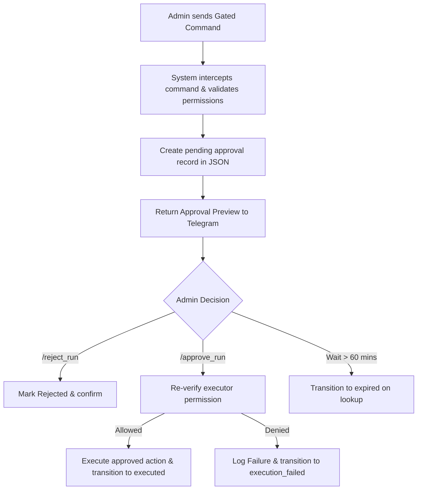

# OpenClaw Runtime Executor v1.10 — Approval Gates Walkthrough

This document outlines the design, implementation, and verification of **OpenClaw Runtime Executor v1.10**, which introduces **Approval Gates** to protect higher-risk commands (e.g. publishing to Google Drive or triggering external workflows) while keeping low-risk commands immediate.

---

## 🔒 1. Concept: Approval Gates

An approval gate intercepts high-risk commands, creates a pending approval record in secure storage, and returns an approval request preview to Telegram. The command is only executed after explicit confirmation from an authorized administrator.

### Approval Lifecycle



---

## 🛠️ 2. Gated vs. Immediate Commands

### Gated Commands (Tier 3: Publish)
These commands generate a pending approval record (expires in 60 minutes or as configured by `OPENCLAW_APPROVAL_TTL_MINUTES`):
- `/run_publish <bot_slug> <user_request>` (aliases: `/rp`, `/run_bot_publish`)
- `/run_preset_publish <preset_id> <input>`
- `/drive_republish_latest`

### Immediate Commands (Tier 2: Generate Only / Tier 1: Read Only)
These commands execute immediately without creating approvals:
- `/run_bot <bot_slug> <user_request>` (aliases: `/run`, `/runtime_run`)
- `/run_preset <preset_id> <input>`
- `/drive_publish_pending`
- `/drive_publish_latest`
- `/drive_latest`
- `/run_status`
- `/run_latest`
- `/run_history`
- `/run_job <job_id>`
- `/run_search <query>`
- `/run_by_bot <bot_slug>`
- `/run_reindex`
- `/run_permissions`
- `/preset_list`
- `/preset_info <preset_id>`

---

## 📋 3. Stored Approval Record Structure

Approvals are stored inside [runtime-approvals.json](file:///c:/Users/12132/.gemini/antigravity/playground/primal-astro/openclaw/runtime/logs/runtime-approvals.json). 

```json
{
  "approvalId": "ap_20260604_172032_7f903e",
  "status": "executed",
  "createdAt": "2026-06-04T21:20:32.757Z",
  "expiresAt": "2026-06-04T22:20:32.757Z",
  "requestedByChatIdHash": "5994471abb01112a",
  "command": "run_publish",
  "commandTier": "publish",
  "botSlug": "content-forge",
  "presetId": null,
  "inputPreview": "Generate exact file post approval",
  "safePayload": {
    "text": "/run_publish content-forge Generate exact file post approval",
    "message": { "chat": { "id": 12345 } }
  },
  "resultJobId": "rt_20260604_172032_29b339",
  "resultFilename": "2026-06-04_17-20-32_content-forge_runtime_result.md",
  "driveLink": "openclaw/outbox/google_drive_mock/OpenClaw/Telegram Responses/2026-06-04_17-20-32_content-forge_runtime_result.md",
  "approvedAt": "2026-06-04T21:20:32.760Z",
  "rejectedAt": null,
  "executedAt": "2026-06-04T21:20:32.781Z",
  "safeMessage": "..."
}
```

*Note: User Chat IDs are hashed via SHA-256 for privacy. Absolute paths in driveLink and messages are sanitized/redacted when shown to Telegram.*

---

## ⚡ 4. New Telegram Commands Added

All new commands are restricted to allowed Telegram admin chat IDs:

### 1. `/approval_list`
- Shows up to 5 pending approvals.
- Next commands suggestions: `/approve_run <approval_id>`.

### 2. `/approval_info <approval_id>`
- Displays status, preview, expires timestamp, and metadata.
- Suggestions: `/approve_run <approval_id>`, `/reject_run <approval_id>`.

### 3. `/approve_run <approval_id>`
- Validates the request, re-checks permission against the approver's chat ID, executes, publishes, and updates status to `executed`.

### 4. `/reject_run <approval_id>`
- Rejects a pending approval record. Non-pending approvals cannot be run.

---

## 📂 5. Files Changed

1. **[runtime-approvals.js](file:///c:/Users/12132/.gemini/antigravity/playground/primal-astro/openclaw/runtime/runtime-approvals.js) [NEW]**: Storage manager for approvals.
2. **[handlers.js](file:///c:/Users/12132/.gemini/antigravity/playground/primal-astro/interfaces/telegram/handlers.js) [MODIFY]**: Intercepts `/run_publish`, `/run_preset_publish`, `/drive_republish_latest`. Adds `/approval_list`, `/approval_info`, `/approve_run`, `/reject_run`. Dynamically formats `/run_status`, `/run_config`, and `/run_metrics`.
3. **[runtime-permissions.js](file:///c:/Users/12132/.gemini/antigravity/playground/primal-astro/openclaw/runtime/runtime-permissions.js) [MODIFY]**: Adds approval commands, registers gated metadata, and appends `(gated)` inside `/run_permissions`.
4. **[runtime-metrics.js](file:///c:/Users/12132/.gemini/antigravity/playground/primal-astro/openclaw/runtime/runtime-metrics.js) [MODIFY]**: Adds aggregation and safe config fields for approval counts.
5. **[runtime-inspector.js](file:///c:/Users/12132/.gemini/antigravity/playground/primal-astro/openclaw/runtime/runtime-inspector.js) [MODIFY]**: Adds status fields for approval gates state.
6. **[test-runtime-executor.js](file:///c:/Users/12132/.gemini/antigravity/playground/primal-astro/scratch/test-runtime-executor.js) [MODIFY]**: Adds 32 new automated test cases (Tests 151-182).
7. **[test-drive-publisher.js](file:///c:/Users/12132/.gemini/antigravity/playground/primal-astro/scratch/test-drive-publisher.js) [MODIFY]**: Fixes test execution permissions by specifying `TELEGRAM_ALLOWED_RUNTIME_CHAT_IDS`.

---

## 🧪 6. Test Suite Results

All three testing modules are 100% green:

1. **Runtime Executor Test Suite (181 tests):**
   ```
   📊 Runtime Executor Tests (v1.10): 181 | ✅ Passed: 181 | ❌ Failed: 0
   ```
2. **Google Drive Publisher Test Suite (12 tests):**
   ```
   📊 Tests Run: 12 | ✅ Passed: 12 | ❌ Failed: 0
   ```
3. **OpenClaw Bot Routing Test Suite:**
   ```
   ✅ ALL BOT ROUTING & STATUS TESTS PASSED SUCCESSFULLY!
   ```

---

## 🔮 7. Recommendation for v1.11

- **Staging / Production Sync**: Integrate approval gates with the webhook notification channels so that developers receive a rich Telegram button layout to approve/reject commands instantly (utilizing Telegram inline keyboards).
- **Hermes Orchestrator Integration**: Allow Hermes to generate preset run requests directly through the approval manager.
