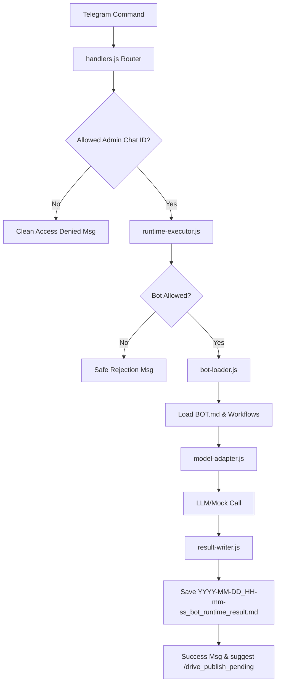

# OpenClaw Runtime Executor v1 Walkthrough

The **OpenClaw Runtime Executor v1** enables authorized Telegram administrators to execute approved bots directly from their chat interface, generating result markdown strategy blueprints on the Railway production server.

---

## What was Added

1. **`openclaw/runtime/` Component Directory**:
   - `runtime-allowlist.js`: Restricts runtime executions to approved bots (currently only `revenue-master-orchestrator`).
   - `runtime-config.js`: Parses and checks model configurations, model timeout rules, character limitations, and authorized chat IDs.
   - `bot-loader.js`: Safely resolves the active workspace directory, loads the bot's `BOT.md` identity file, and compiles workflow markdown specifications without path traversal.
   - `model-adapter.js`: Handles LLM communication for OpenAI, Anthropic, OpenRouter, and a Mock provider, enforcing timeouts and key validation checks.
   - `result-writer.js`: Formats the LLM output into a standard OpenClaw markdown structure and saves it to the responses outbox.
   - `runtime-executor.js`: Directs validation, context loading, model execution, formatting, and file-saving operations.

2. **Global Skills**:
   - Registered `openclaw-runtime-executor-builder`, `telegram-command-router-updater`, and `markdown-result-writer` global skill configurations.

3. **Isolated Test Suite**:
   - `scratch/test-runtime-executor.js`: A comprehensive, 11-stage sandbox test suite that checks validations, mock generation, filename sanitization, router commands, and publisher integration.

---

## Changed Files & New Commands

- **[MODIFY] [handlers.js](file:///c:/Users/12132/.gemini/antigravity/playground/primal-astro/interfaces/telegram/handlers.js)**:
  - Wired `/run_bot` (aliases `/run` and `/runtime_run`) command parsing.
  - Implemented sender verification.
  - Integrated command help documentation.

- **New Commands**:
  - `/run_bot <bot_slug> <user_request>` (also supports `/run` and `/runtime_run`).

---

## Core System Architecture & Workflows

### 1. Security & Admin Restriction
Access is locked down via `TELEGRAM_ALLOWED_RUNTIME_CHAT_IDS`. Incoming chat IDs are validated before processing the request. Unknown bots are blocked, filenames are strictly sanitized against path traversal, and the model adapter is protected from exposing keys/credentials in errors or logs.

### 2. Model Adapter & Mock Testing
The adapter accepts `OPENCLAW_MODEL_PROVIDER=openai|anthropic|openrouter|mock`. When set to `mock`, it returns a deterministic output structure containing `SUMMARY:` and `CONTENT:` blocks, allowing tests to verify execution logic without external APIs or keys.

### 3. Connection to Drive Publishing
Result files are written to `openclaw/outbox/telegram-responses/`. This is an approved directory, so the generated files pass safety checks. Drive publishing remains a manual step: users run `/drive_publish_pending` to upload the newly generated result.

---

## Verification Results

Both test suites executed and passed successfully:

### 1. Runtime Executor Sandbox (`node scratch/test-runtime-executor.js`)
- **Test 1**: Config environment parsing and chat ID checks. (Passed)
- **Test 2**: Rejection of unauthorized chat IDs. (Passed)
- **Test 3**: Rejection of unknown bot slugs. (Passed)
- **Test 4**: Graceful handling of empty requests. (Passed)
- **Test 5**: Clean error on missing LLM credentials. (Passed)
- **Test 6**: Mock provider parsed response formatting. (Passed)
- **Test 7**: Secure traversal-free bot loading. (Passed)
- **Test 8**: Valid output template layout schemas. (Passed)
- **Test 9**: Router command routing (aliases + multiline). (Passed)
- **Test 10**: Updated `/help` command output. (Passed)
- **Test 11**: Drive publisher compatibility check. (Passed)

### 2. Regression Publisher Tests (`node scratch/test-drive-publisher.js`)
- All **12/12** existing publisher tests passed successfully, confirming no regressions.

---

## Next Steps for v2
- Add `content-forge` as the second approved runtime bot.
- Introduce auto-publishing via `/run_bot_publish`.
- Integrate Hermes workflow queue management.
