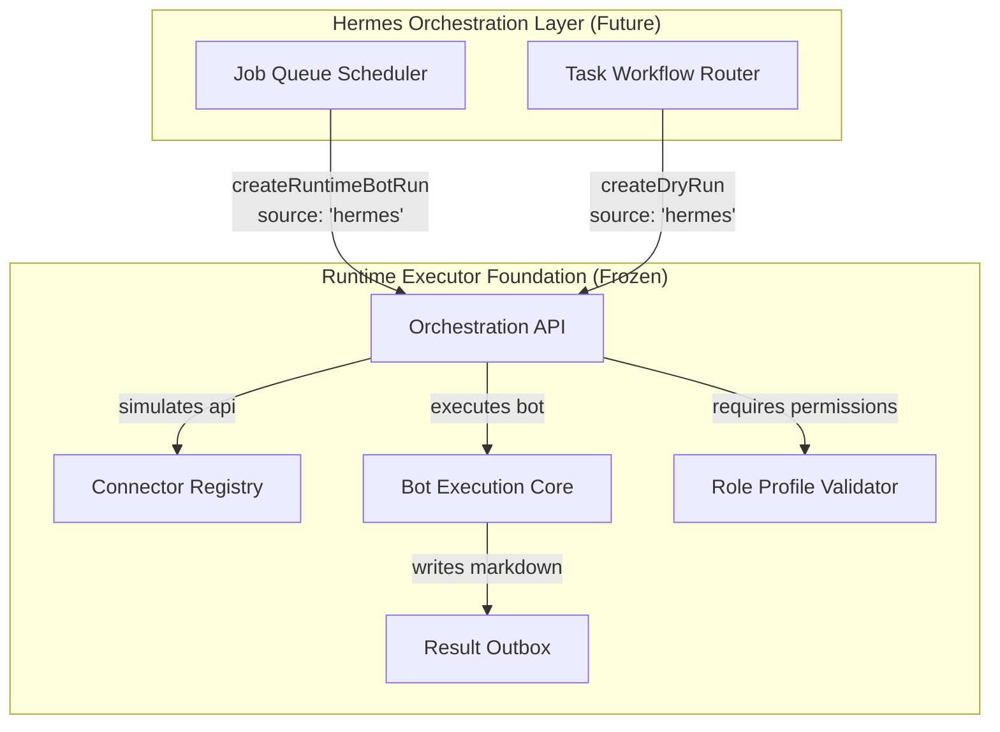

# OpenClaw Runtime Executor — Final Freeze Report (v1.13)

This report details the completion and final freeze of the OpenClaw Runtime Executor foundation before handoff to the Hermes orchestration layer.

> [!IMPORTANT]
> **Runtime feature development is now frozen except for Hermes-required bug fixes or adapter changes.**
> This codebase establishes a verified, secure execution layer that guarantees zero real external writes and complete permission compliance. Future scheduling, queueing, and workflow execution will be handled separately in the Hermes project.

---

## 📋 1. Handoff & Boundaries Alignment



---

## ⚡ 2. Completion Status by Phase

### R0 — Baseline Audit & Test Execution
*   **Status**: Completed & Verified.
*   All existing 271 unit/integration tests in the `test-runtime-executor.js` suite pass successfully.
*   Bot loader schemas, permission configurations, and command parsing logic are fully regression-tested.

### R1 — Role Profiles Verification
*   **Status**: Completed & Verified.
*   Verified five distinct roles (`super_admin`, `operator`, `publisher`, `approver`, `viewer`) mapped to effective capability groups.
*   Verified self-approval prevention (non-super-admins cannot approve their own requests).
*   Verified that viewers are strictly read-only and cannot trigger runs.

### R2 — Dry-Run-Only Connector Registry
*   **Status**: Completed & Integrated.
*   Created `connector-schemas.json` and `connector-registry.js` registering 6 connectors (`ghl`, `airtable`, `google_places`, `webhook`, `email`, `sms`).
*   Verified that real network requests are completely blocked.
*   Integrated connector telemetry into command line utilities:
    *   `/connector_list` — Lists all registered connectors and execution status.
    *   `/connector_info <id>` — Retrieves env parameters and boundaries.
    *   `/connector_validate <id>` — Runs mock validation checks on required env vars.
    *   `/dryrun_types` — Lists all 8 supported mock action templates.
    *   `/dryrun_action <type> <request>` — Simulates external write and saves a telemetry report.

### R3 — Runtime Orchestration API
*   **Status**: Completed & Tested.
*   Created `runtime-orchestration-api.js` exporting 10 core integration endpoints.
*   **Source-Awareness**: Every function requires a `source: 'telegram' | 'hermes' | 'test' | 'system'` parameter.
*   **Structured JSON Contract**: Success/error states return consistent responses matching the contract schema (including `ok`, `status`, `errorCategory`, `safeMessage`, `jobId`, `approvalId`, `dryrunId`).
*   Created a validation suite `test-runtime-orchestration-api.js` containing 12 unit tests, verifying Hermes readiness and mockPreset runs.

### R4 — Runtime Contract Documentation
*   **Status**: Completed.
*   Created [RUNTIME_CONTRACT.md](file:///c:/Users/12132/.gemini/antigravity/playground/primal-astro/openclaw/runtime/RUNTIME_CONTRACT.md) in the runtime folder to serve as the definitive integration spec for developers.

### R5 — Final Runtime Freeze
*   **Status**: Completed.
*   All verification suites verified. No further functional changes will be merged into the runtime execution core.

---

## 🛠️ 3. Verification Log & Status Output

Executing `/run_status` or `/run_config` outputs the verified status of the Connector Registry:

```text
Connector Registry: Enabled
Real External Execution: Disabled
Connectors: 6
Dry-run only: Yes
```

### Command Validation Output

1.  **Orchestration API Verification**:
    ```bash
    node scratch/test-runtime-orchestration-api.js
    ```
    *Output:*
    ```text
    🧪 Starting OpenClaw Runtime Orchestration API Test Suite...
    ✅ Test PASSED: Test 1: Validate source field required check
    ✅ Test PASSED: Test 2: Viewer cannot run createRuntimeBotRun
    ✅ Test PASSED: Test 3: Hermes calling createRuntimeBotRun succeeds in mock mode
    ✅ Test PASSED: Test 4: createRuntimePresetRun succeeds for authorized actor
    ✅ Test PASSED: Test 5: createPublishApproval creates pending approval
    ✅ Test PASSED: Test 6: createPresetPublishApproval creates pending approval
    ✅ Test PASSED: Test 7: createDryRun returns valid simulated payload and report
    ✅ Test PASSED: Test 8: createDryRunPublishApproval creates pending approval
    ✅ Test PASSED: Test 9: getRuntimeJobStatus retrieves job status
    ✅ Test PASSED: Test 10: getApprovalStatus retrieves pending approval details
    ✅ Test PASSED: Test 11: getDryRunStatus retrieves dry-run details
    ✅ Test PASSED: Test 12: getRuntimeSystemStatus returns healthy online status

    📊 Orchestration API Tests: 12 | ✅ Passed: 12 | ❌ Failed: 0
    ```

2.  **Core Executor Verification**:
    ```bash
    node scratch/test-runtime-executor.js
    ```
    *Output:*
    ```text
    📊 Runtime Executor Tests (v1.13): 271 | ✅ Passed: 271 | ❌ Failed: 0
    ```

3.  **Bot Routing Verification**:
    ```bash
    node testing/test-activated-bots.js
    ```
    *Output:*
    ```text
    ✅ ALL BOT ROUTING & STATUS TESTS PASSED SUCCESSFULLY!
    ```

---

## 🚫 4. Deployment Constraints

*   **No Network Operations**: Any modification attempting to make live network requests to external APIs must be rejected.
*   **Unchanged Bot Slugs**: No new runtime bots may be approved or modified.
*   **Strict Access Control**: Capability tokens must strictly obey the role matrices defined in the contract.
